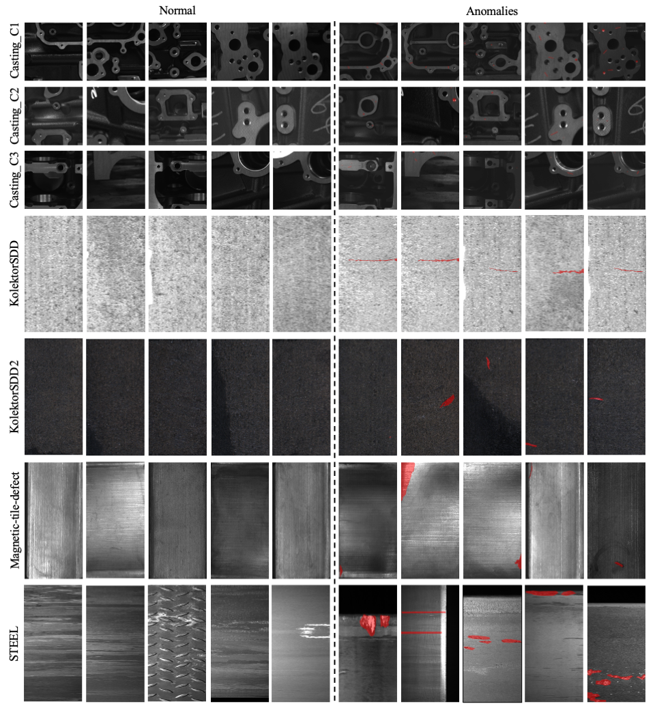

# HSS-IAD-Dataset
Dataset for paper "HSS-IAD: A Heterogeneous Same-Sort Industrial Anomaly Detection Dataset"[paper](https://ieeexplore.ieee.org/document/11208914)

Give me a star if you like it!!!

## News
 - 03/21/2025: Accepted by ICME2025!🚀
 - 17.04.2025:Translated and reposted by our College’s Official WeChat Account "[智能机器人研究院](https://mp.weixin.qq.com/s/On7j8CS79s0_7SRaJhD97A)".

## Overview
This project introduce the Heterogeneous Same-Sort Industrial Anomaly Detection (HSSIAD) dataset, which contains 8,580 images of metallic-like industrial parts and precise anomaly annotations. These parts exhibit variations in structure and appearance, with subtle defects that closely resemble the base materials. We also provide foreground images for synthetic anomaly generation. The HSS-IAD dataset stands out for its focus on same-sort industrial products with variations in structure and appearance. It tackles the challenge of detecting subtle defects that closely resemble base materials, which are common in real-world industrial settings. The dataset's design—covering various defects and interference sources like machining marks and oil stains—is original and innovative. This is in contrast to previous datasets that do not address these practical issues effectively. we provide visualizations of three objects (Casting\_C1, Casting\_C2, Casting\_C3) and four textures (KolektorSDD, KolektorSDD2, Magnetic-tile-defect, STEEL) in HSS-IAD, as shown in Fig. 1.

The left side displays the normal images of each type in the dataset, while the right side shows different anomalies within each type of object or texture. All anomaly regions are marked in red.

## Data Usage

The image data can be downloaded [here](https://drive.google.com/file/d/13lBfOodsfkkQhX7PJ7kT8qc2KuHqwD4L/view?usp=sharing). 
